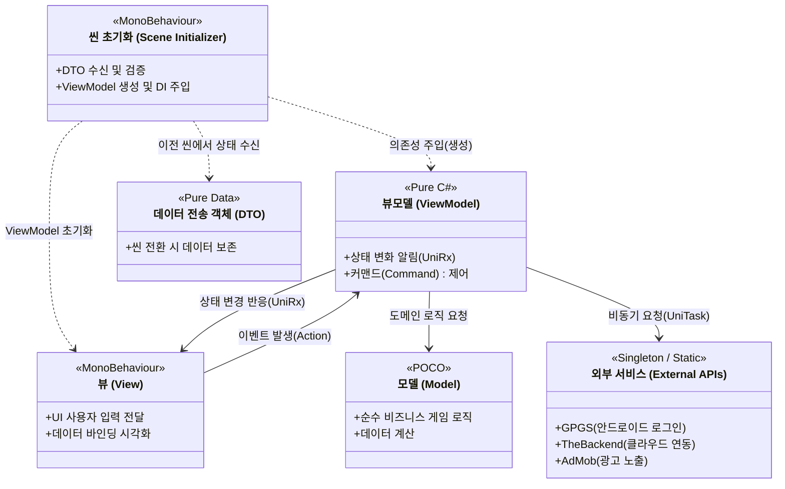

# AscenDungeon Remake
(기업반 프로젝트 리팩토링 및 고도화 버전)

## 📌 프로젝트 소개
본 프로젝트는 기존 프로젝트의 퀄리티를 상용 수준으로 끌어올리기 위해 객체지향 설계(SOLID) 리팩토링한 결과물입니다. 
안정적인 서비스 운영과 손쉬운 유지보수를 목표로 **MVVM**, **DI(Dependency Injection)**, **POCO(Plain Old C# Object)** 기반의 클린 코드 구조를 채택했습니다.

## 🛠 기술 스택
- **Engine**: Unity 2022.3+ (C# 9.0+)
- **Architecture**: MVVM, DI, State Machine(FSM)
- **Concurrency**: Cysharp/UniTask, UniRx
- **Animation**: DOTween

## 🔌 주요 연동 기술 (Third-Party Integrations)
상용 게임 출시에 필수적인 기능들을 설계 원칙에 따라 결합도가 낮은 형태로 완벽하게 통합했습니다.

- **Google Play Games Services (GPGS v11+)**: 서버 인증 코드 발급 및 안드로이드 네이티브 로그인 시스템 구축
- **The Backend (뒤끝 서버)**: 클라우드 세이브, 토큰/게스트 로그인 및 유저 데이터 비동기 영구 관리 (`UniTask` 기반 통신)
- **Google AdMob**: 전면 광고(Interstitial) 및 보상형 광고(Rewarded Ad) 연동 구축 (`AdsManager`를 통한 일원화)

## 🏗 코어 아키텍처 (Clean Architecture)
유니티 엔진의 `MonoBehaviour` 종속성에서 벗어나, 순수 비즈니스 로직의 테스트 용이성과 재사용성에 집중할 수 있는 설계를 지향합니다.

### 1. 전역 상태 배제 및 순수 객체(POCO) 지향
- 무분별한 싱글톤 패턴(`GameManager.Instance`) 사용을 엄격히 배제했습니다.
- 코어 게임 로직과 인게임 데이터 계산(데미지 판정, 퍼즐 로직 등)은 `MonoBehaviour`를 상속받지 않는 일반 C# 클래스로 캡슐화했습니다.

### 2. UI 개발의 표준화: MVVM 패턴
- **Model**: 유니티 엔진이나 View의 존재를 전혀 모르는 순수 데이터 구조
- **ViewModel**: UI가 구독할 상태(State)와 명령(Command)을 캡슐화하며, `UniRx`를 사용하여 반응형 처리를 구현
- **View**: `MonoBehaviour` 상속 객체로 오직 데이터 바인딩(Visual)과 사용자 입력 이벤트 콜백만을 담당

### 3. 안전한 씬 간 데이터 전송: DTO 패턴
- 씬(Scene) 전환 시 유지되어야 하는 데이터(플레이어 레벨, 체력, 인벤토리 등)는 **DTO(Data Transfer Object)** 구조체를 활용합니다.
- 전역 객체에 의존하여 데이터를 넘기는 안티 코딩 패턴 대신, 씬 로더를 통해 다음 씬의 진입점 역할을 하는 Initializer로 데이터를 안전하게 주입(DI)합니다.

### 4. 확장성을 고려한 디자인 패턴 적용
- **팩토리 패턴(Factory Method)**: 몬스터, 퍼즐 및 투사체의 동적 객체 풀링(Object Pooling) 연동 통일
- **전략 패턴(Strategy)** 및 **상태 패턴(State)**: AI 패턴 제어 및 플레이어 런타임 제어 알고리즘의 유연한 교체

### 5. 전체 아키텍처 구조도 (Architecture Diagram)

---

> *본 프로젝트의 모든 시스템은 동료 피드백 및 코드 리뷰를 가정하여, 유지보수성과 확장성에 초점을 맞춰 지속적으로 리팩토링되고 있습니다.*